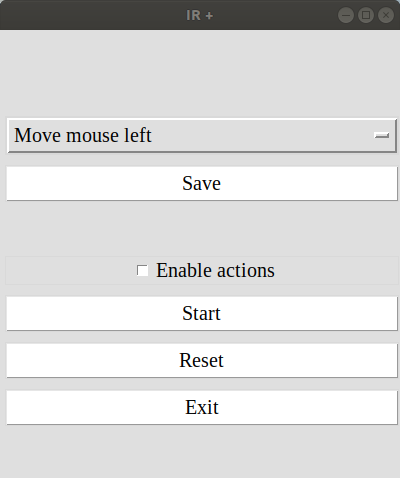
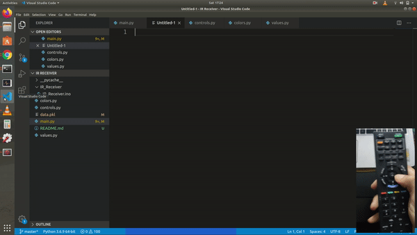

# IR +

A hardware extension that adds IR capability to your PC / laptop, making it remote controllable.

## Features

* Enables capability to control device from distance
* Easy setup
* Configure your own actions
* Works with any IR remote
* Fast typing
* Accelerated mouse movement with precision.

## Hardware

* Arduino Board (Nano)
* IR receiver

## Software

* Arduino Sketch
* Python

## Demo





## Setup

**Step 1)** Install the required modules.

```
pip install pyserial
```

```
pip install pynput
```

**Step 2)** Install Arduino IDE

**Step 3)** Identify the COM port

1. Open Device Manager, and check Ports(COM & LPT)

or

2. Use below python script to identify the ports

```
import serial.tools.list_ports

ports = serial.tools.list_ports.comports()
for port, desc, hwid in sorted(ports):
    print(f"Port: {port}, Description: {desc}, Hardware ID: {hwid}")
```

**Step 4)** Update the ARDUINO_PORT in values.py file

## Running

**Step 1)** Run the main.py file

```
python main.py
```

**Step 2)** Reset any old existing configuration, using the "Reset" button

**Step 3)** Click on "Start", making sure "Enable actions" in disabled.

**Step 4)** Use your remote and press a button. Once you see a unique signal, select an appropriate action from the dropdown and click on "Save" button.

**Step 5)** After saving all actions, select the "Enable actions" checkbox.

**Step 6)** Use your remote to perform the assigned actions. Enjoy!!